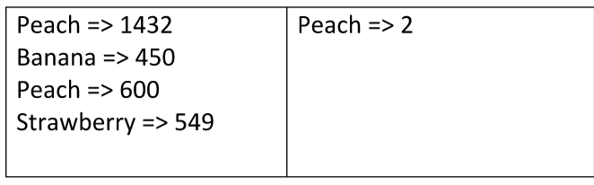

# Cappy Juice
You will be given different juices, as strings. You will also receive quantity as a number. If you receive a juice, you
already have, you must sum the current quantity of that juice, with the given one. When a juice reaches 1000
quantity, it produces a bottle. You must store all produced bottles and you must print them at the end.

Note: 1000 quantity of juice is one bottle. If you happen to have more than 1000, you must make as much bottles
as you can, and store what is left from the juice.

Example: You have 2643 quantity of Orange Juice – this is 2 bottles of Orange Juice and 643 quantity left.

The input comes as array of strings. Each element holds data about a juice and quantity.

The output is the produced bottles. The bottles are to be printed in order of obtaining the bottles. Check the
second example bellow - even though we receive the Kiwi juice first, we don’t form a bottle of Kiwi juice until the 4 th
line, at which point we have already create Pear and Watermelon juice bottles, thus the Kiwi bottles appear last in
the output.

Example:

# 