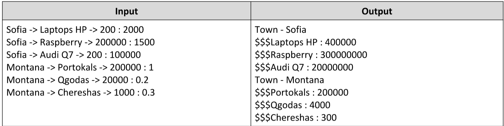

# City Markets
You have been tasked to follow the sales of products in the different towns. For every town you need to keep track
of all the products sold, and for every product, the amount of total income.

The input comes as array of strings. Each element will represent data about a product and its sales. The format of
input is:

{town} -> {product} -> {amountOfSales} : {priceForOneUnit}

The town and product are both strings. The amount of sales and price for one unit will be numbers. Store all towns,
for every town, store its products, and for every product, its amount of total income. The total income is calculated
with the following formula - amount of sales * price for one unit. If you receive as input a town you already have,
you should just add the new product to it.

As output you must print every town, its products and their total income.
The order of output for each of those entries is – by order of entrance.

Example:

# 
