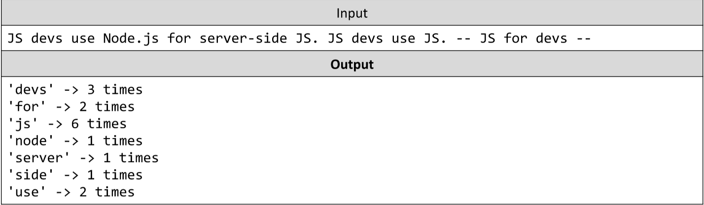

# Count Words in a Text
You are tasked to count the number of words in a text using a Map, any combination of letters, digits and _
(underscore) should be counted as a word. The words should be stored in a Map - the key being the word and the
value being the amount of times the word is contained in the text. The matching should be case insensitive. Print
the words in a sorted order.

The input comes as an array of strings containing one entry - the text whose words should be counted. The text may
consist of more than one sentence.

The output should be printed on the console - print each word in the map in the format &quot;&#39;&lt;word&gt;&#39; -&gt; &lt;count&gt;times&quot;, each on a new line.
Example:

# 
