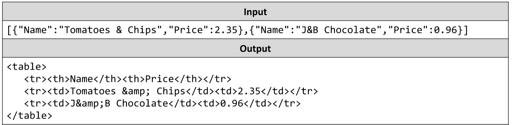

# From JSON to HTML Table
You’re tasked with creating an HTML table of students and their scores. You will receive a single string representing
an array of objects, the table’s headings should be equal to the objects’ keys, while each object’s values should be
a new entry in the table. Any text values in an object should be escaped, in order to avoid introducing dangerous
code into the HTML.
Object’s keys will always be the same.
The input comes as an array of strings containing a single string - the array of objects.
The output should be printed on the console - for each entry row in the input print the object representing it.
Example:

# 