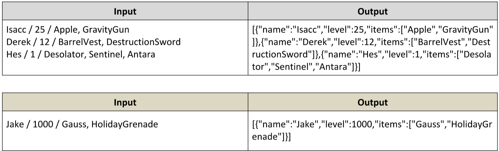

# Heroic Inventory
In the era of heroes, every hero has his own items which make him unique. Create a function which creates a
register for the heroes, with their names, level, and items, if they have such. The register should accept data in a
specified format, and return it presented in a specified format.

The input comes as array of strings. Each element holds data for a hero, in the following format:
“{heroName} / {heroLevel} / {item1}, {item2}, {item3}...”
You must store the data about every hero. The name is a string, the level is a number and the items are all strings.

The output is a JSON representation of the data for all the heroes you’ve stored. The data must be an array of all
the heroes.
Example:

# 