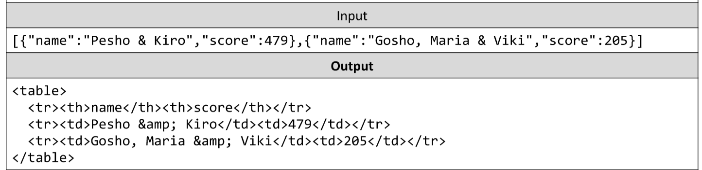

# Score to HTML
You are given a JSON string representing an array of objects, parse the JSON and create a table using the supplied
objects. The table should have 2 columns "name" and "score", each object in the array will also have these keys.
Any text elements must also be escaped in order to ensure no dangerous code can be passed.
You can either write the HTML escape function yourself or use the one from the Strings and Regular Expressions Lab.
The input comes as an array of strings containing a single string - the array of objects as a JSON.
The output should be printed on the console - a table with 2 columns - "name" and "score", containing the values
from the objects as rows.
Example:

# 