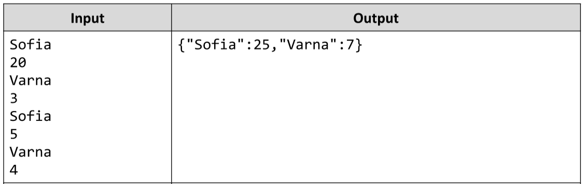

# Sum by Town
You’re tasked with calculating the total sum of income for a number of Towns. You will receive an array of strings
representing towns and their incomes, every even index will be a town and every odd index will be an income
belonging to that town. Create an object that will hold all the towns as keys and their total income (the sum of their
incomes) as values to those keys and print it as a JSON.
The input comes as an array of strings - each even index is the name of a town and each odd index is an income
belonging to that town.
The output should be printed on the console - JSON representation of the object containing all towns and their total
incomes.
Example:

# 