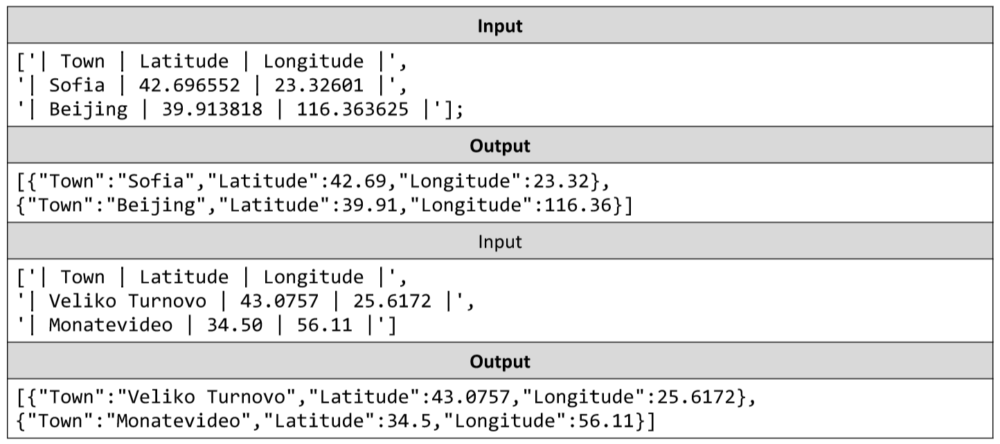

# Towns to JSON
You’re tasked to create and print a JSON from a text table. You will receive input as an array of strings, where each
string represents a row of a table, with values on the row encompassed by pipes '|' and optionally spaces. The
table will consist of exactly 3 columns “Town”, “Latitude” and “Longitude”. The latitude and longitude columns will
always contain valid numbers. Check the examples to get a better understanding of your task.
The input comes as an array of strings - the first string contains the table’s headings, each next string is a row from
the table.
The output should be printed on the console - for each entry row in the input print the object representing it.
Example:

# 