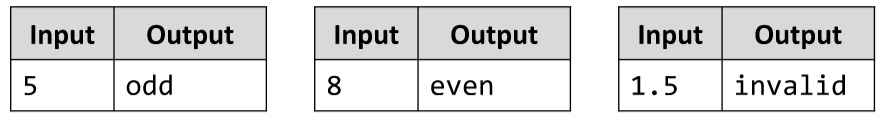

# Odd or Even
Write a JS function to check if a number is odd or even or invalid (fractions are neither odd nor even).
The input comes as array of one string element, holding a number.
The output should be printed to the console. 
Print odd for odd numbers, even for even number and invalid for numbers that contain decimal fractions.
Example:

# 