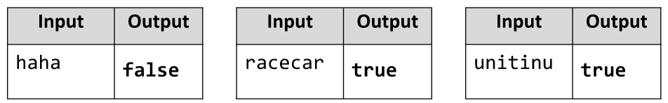

# Palindrome
Write a JS function that checks if an input string is a palindrome.
The input comes as an array with a single string element.
The output is the return value of your function. 
It should be true if the string is a palindrome and false if it’s not.
Example:

# 