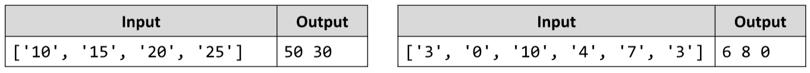

# Process Odd Numbers
You are given an array of numbers. Write a JS function that prints the elements at odd positions from the array, doubled and in reverse order.
The input comes as array of string elements holding numbers.
The output is printed on the console on a single line, separated by space.
Example:

# 