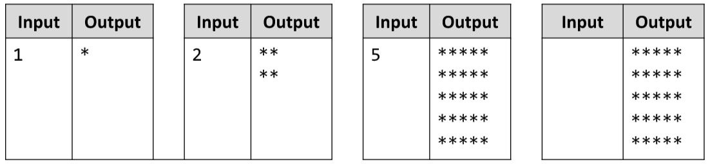

# Rectangle of Stars
Write a JS function that outputs a rectangle made of stars with variable size, depending on an input parameter.
If there is no parameter specified, the rectangle should always be of size 5. Look at the examples to get an idea.
The input comes as an array with one string element in it, which needs to be parsed to a number.
The output is a series of lines printed on the console, forming a rectangle of variable size
Example:

# 