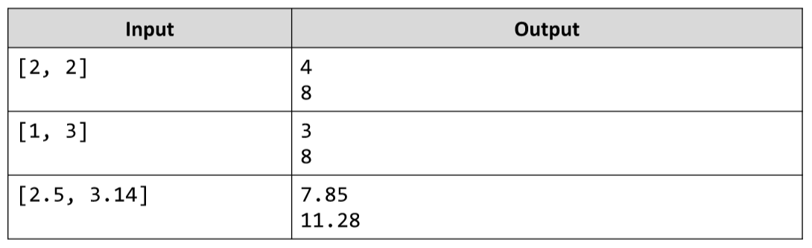

# Rectangle
Write a JS function that calculates the area and perimeter of a rectangle by given two sides.
The input comes as array of strings that need to be parsed as numbers.
The output should be printed to the console on two lines.
Example:

# 