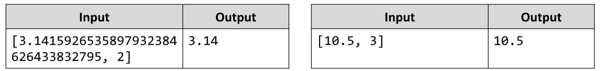

# Rounding
Write a JS function that rounds numbers to specific precision.
The input comes as an array of two string elements that need to be parsed as a numbers. The first value is the
number to be rounded and the second is the precision (significant decimal places). 
If a precision is passed, that is more than 15 it should automatically be reduced to 15.
The output should be printed to the console. Do not print insignificant decimals.Examples:

# 