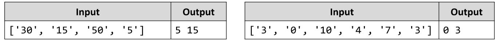

# Smallest Two Numbers
Write a JS function that prints the two smallest elements from an array of numbers.
The input comes as array of string elements holding numbers.
The output is printed on the console on a single line, separated by space.
Example:

# 