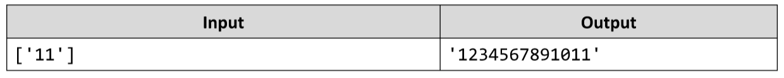

# String of Numbers 1...N
Write a JS function that read a number n as input and prints all numbers from 1 to n, concatenated as a single string.
The input comes as array of one string element that needs to be parsed as a number.
The output should be returned as a result of your function.
Example:

# 