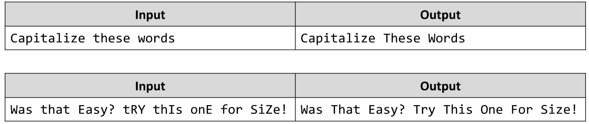

# Capitalize the Words *
Write a JS function that capitalizes the given words. 
You need to make every word’s first letter – uppercase and all other letters – lowercase.
The input comes as a single string, containing words, separated by a space.
The output is the same string, however with all of its words capitalized.
Note: The words can contain any ASCII character. You need to affect only the letters.
Example:

# 