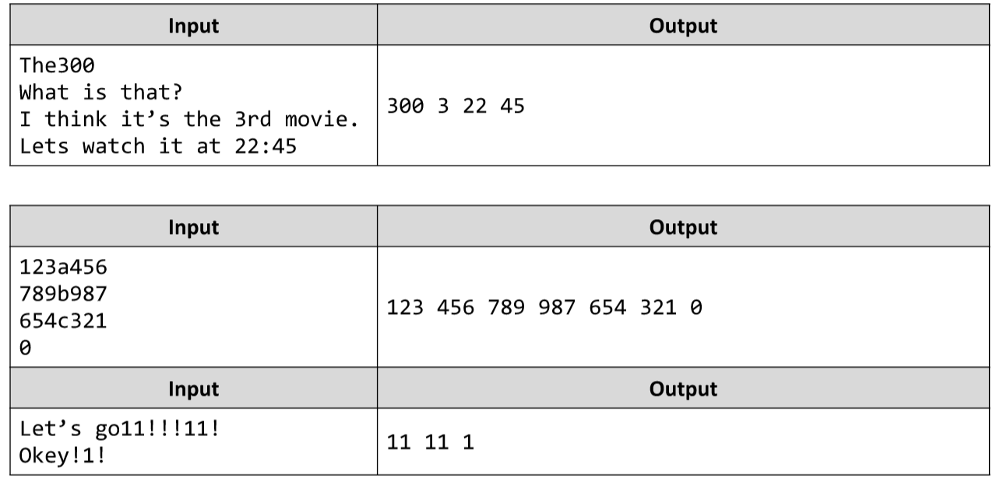

# Capture the Numbers
Write a JS function that finds all numbers in a sequence of strings.
The input comes as array of strings. Each element represents one of the strings.
The output is all the numbers, extracted and printed on a single line – each separated by a single space.
Example:

# 