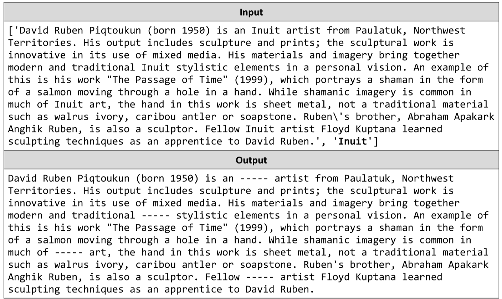

# Censorship
The thought police are at it again and they need your help! Write a JS function that would censor news articles. 
You will be given a text and then a list of strings that need to be blacked out from the text. Replace all occurrences of the
strings with dashes of the same length as the string. The strings will not overlap, so order of processing is not
important. See the examples for more information.
The input comes as array of string elements. The first element is the text to be censored and all following elements
are the strings to be censored.
The output is the return value of your functions. Save the censored results in a string and return it.
Example:

# 