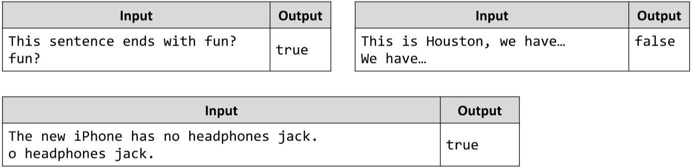

# Check if String ends with a given Substring.
Write a JS function that checks if a given string, ends with a given substring.
The input comes as array of strings. There will always be only 2 strings of input. 
The first string will represent the main one. The second one will represent the substring.
The output is either “true” or “false” based on the result of the check.
The comparison is case-sensitive!
Example:

# 