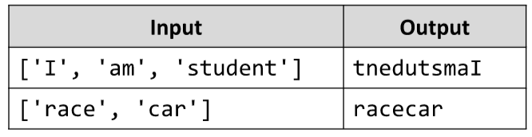

# Concatenate Reversed
Write a JS function that reverses a series of strings and prints them concatenated from last to first.
The input comes as array of strings.
The output is printed on the console. Print all strings concatenated on a single line, 
starting from the last input string, going to the first. Reverse each individual string’s letters.
Example:

# 