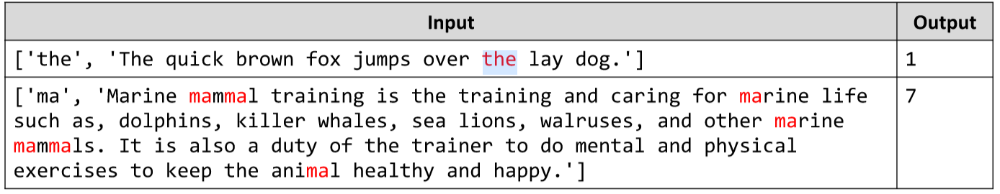

# Count Occurrences
Write a JS function that counts how many times a string occurs in a given text. Overlapping strings are allowed.
The input comes as array of two strings. The first element is the target string and the second element is the text in
which to search for occurrences.
The output should be a number, printed on the console.
Example:

# 

