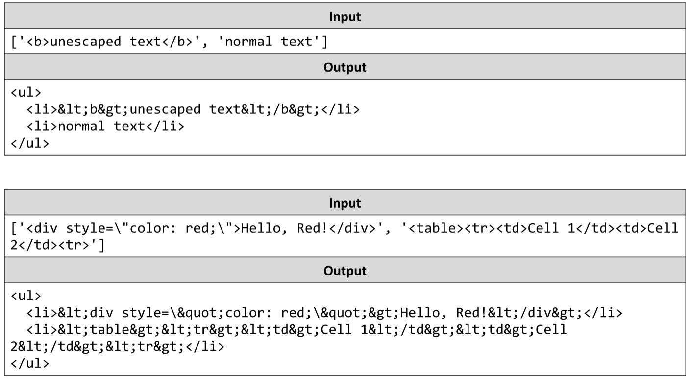

# Escaping
You will be given a list of strings, containing user-submitted data. Write a JS function that prints an HTML list from
the data. The strings, however, may contain special HTML characters, which is an oft-used method for injection
attacks. To prevent unwanted behavior or harmful content, all special characters need to be replaced with their
encoded counterparts – they will look the same to the user, but will not pose a security risk.
The input comes as array of string elements.
The output is the return value of your function. Compose the list in a string and return it. 
See the examples for formatting details.
Example:

# 

