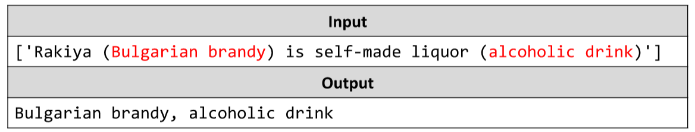

# Extract Text
You will be given a text as a string. Write a JS function that extracts and prints only the text that’s surrounded by
parentheses.
The input comes as array of a single string element.
The output is printed on the console on a single line, in the form of a comma-separated list.
Example:

# 

