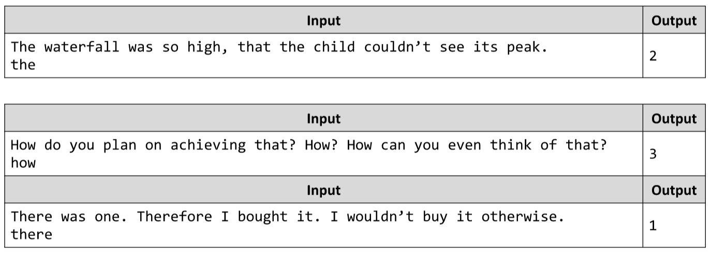

# Find Occurrences of Word in Sentence
Write a JS function that finds, how many times a given word, is used in a given sentence.
Note that letter case does not matter – it is case-insensitive.
The input comes as array of strings. The input will consist of exactly 2 strings. 
The first one will be the sentence, and the second one – the word.
The output is a single number indicating the amount of times the sentence contains the word.
Example:

# 