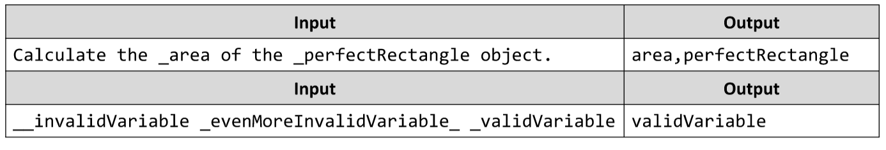

# Find Variable Names in Sentences
Write a JS function that finds all variable names in a given string. A variable name starts with an underscore (“_”)
and contains only Capital and Non-Capital English Alphabet letters and digits. Extract only their names, without the
underscore. Try to do this only with regular expressions.
The input comes as an array of strings containing one element - the string on which you have to perform the
matching.
The output consists of all variable names, extracted and printed on a single line, each separated by a comma.
Example:

# 