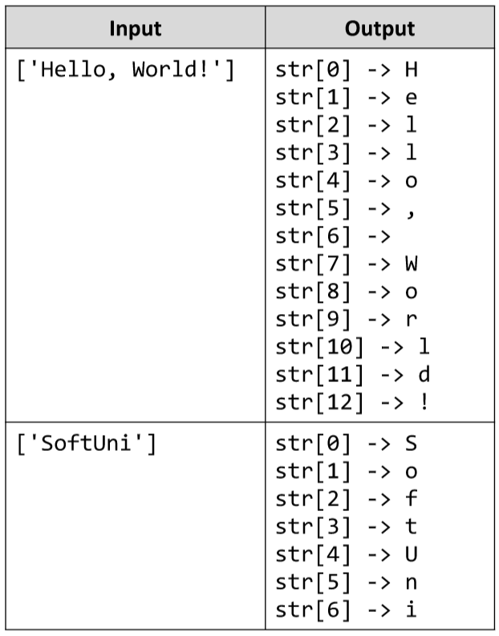

# Print Letters
Write a JS function that prints all the symbols of a string, each on a new line.
The input comes as array of one string element.
The output is printed on the console, each letter on a new line.
Example:

# 