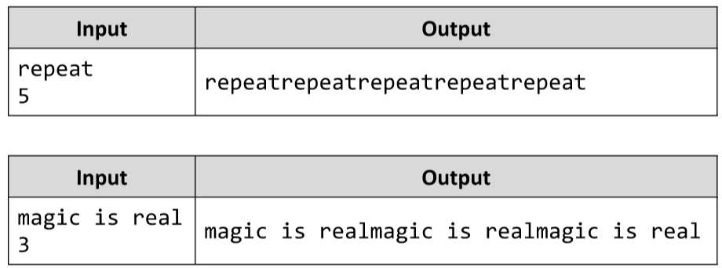

# Repeat a String N Timesex
Write a JS function that repeats a given string, N times.
The input comes as array of strings. There will always be only 2 strings of input. 
The first string will represent the one you need to repeat. 
The second one will represent the times you need to repeat it.
The output is a big string, containing the given one, repeated N times.
Example:

# 