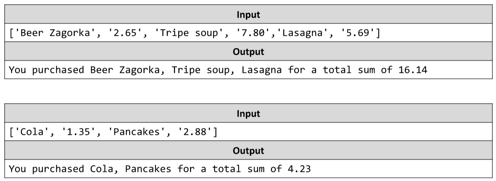

# Restaurant Bill
You are tasked to write a JS function that receives an array of purchases and their prices and prints all your
purchases and their total sum.
The input comes as an array of string elements – the elements on even indexes (0, 2, 4…) are the product names,
while the elements on odd indexes (1, 3, 5…) are the corresponding prices.
The output should be printed on the console - a single sentence containing all products and their total sum in the
format “You purchased {all products separated by comma + space} for a total sum of {total sum of products}”.
Example:

# 

