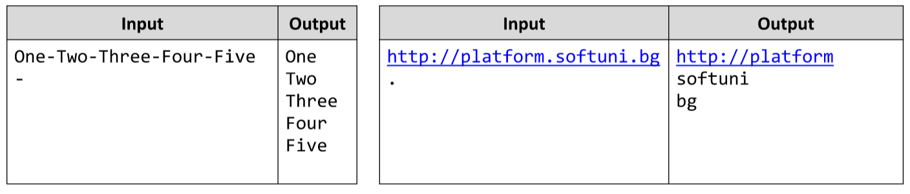

# Split a String with a Delimiter
Write a JS function that splits a string with a given delimiter.
The input comes as an array of strings. There will be exactly 2 strings of input. 
The first one is the string you need to split and the second one is the delimiter.
The output should consist of all elements you’ve received, after you’ve split the given string by the given delimiter.
Each element should be printed on a new line.
Example:

# 
