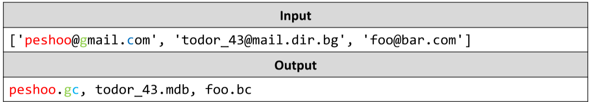

# Usernames
Write a JS function that parses a list of emails and returns a list of usernames, generated from them. 
Each username is composed from the name of the email address, a period and the first letter of every element in the domain name.
See the examples for more information.
The input comes as array of string elements. Each element is an email address.
The output is printed on the console on a single line as a comma-formatted list.
Example:

# 

