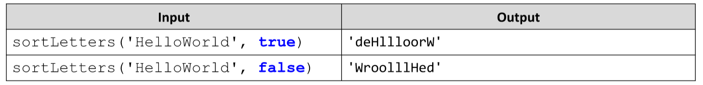

# String's Letters Organizer
Write a JavaScript function sortLetters(string, boolean) that gets as an input a string and a boolean. The function
sorts all letters in the string in alphabetical order and returns the newly formed string. The sorting is ascending if
the boolean is true otherwise the sorting is in descending order.
__Note__: The sorting is case-insensitive but the output should use the same casing as the input!
__Hint__: You are allowed to use .sort() function.
Example:

# 