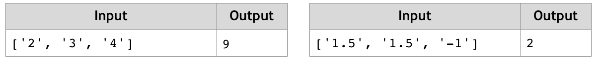

# Sum 3 Numbers
Write a JS function that takes three numbers as input and outputs their sum.
The input comes as array of string elements that need to be parsed as numbers.
The output should be printed to the console. 
Example:

# 