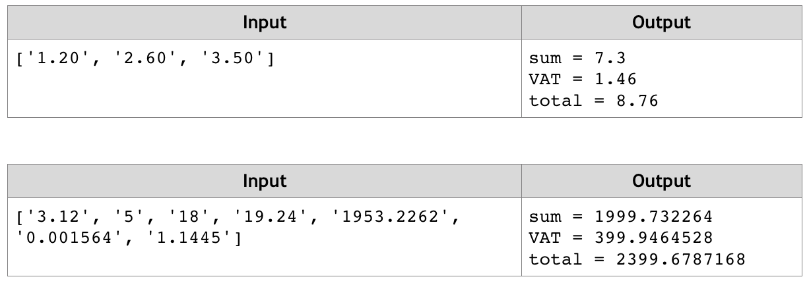

# Sum and VAT
Write a JS function that sums a variable number of prices and calculates their VAT (Value Add Tax, 20%).
The input comes as array of string elements that need to be parsed as numbers. 
The number of elements will be different every time.
The output should be printed to the console on a new line for every entry.
Example:

# 