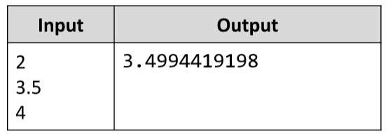

# Triangle Area
Write a JS function that calculates a triangle’s area by its 3 sides.
The input comes as array of three string elements, each holding a number, representing one side of a triangle.
The output should be printed to the console.
Hints: Use __Heron's formula__ to obtain the result.
Example:

# 