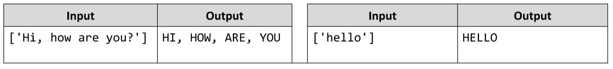

# Words Uppercase *
Write a JS program that extracts all words from a passed in string and converts them to upper case.
The extracted words in upper case must be printed back on a single line concatenated by “, “.
The input comes as an array of strings with only one entry - the text from which to extract and convert the words.
The output should be a single line containing the converted string.
Example:

# 